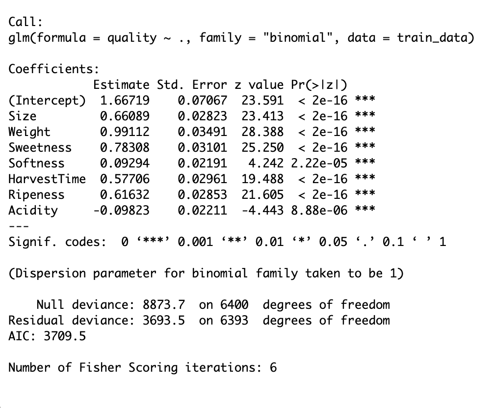
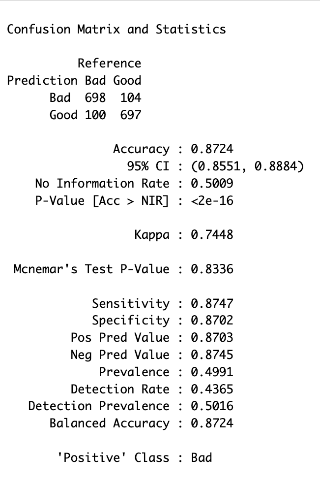
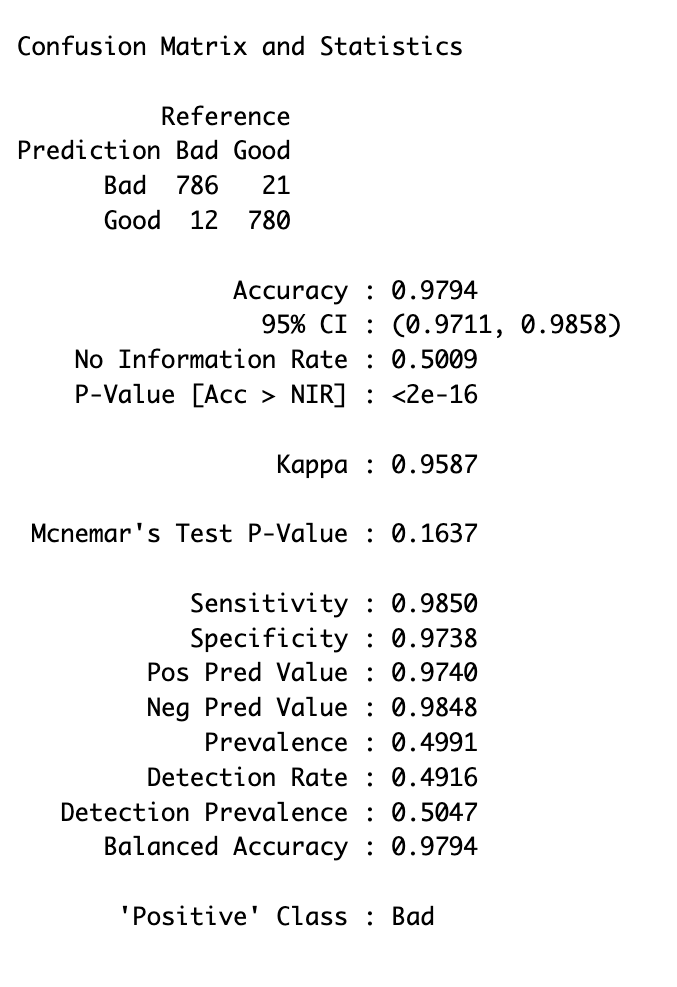
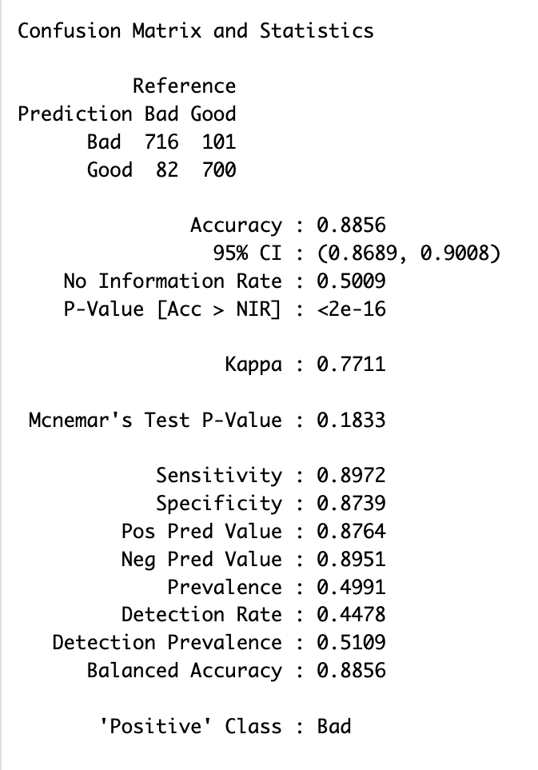
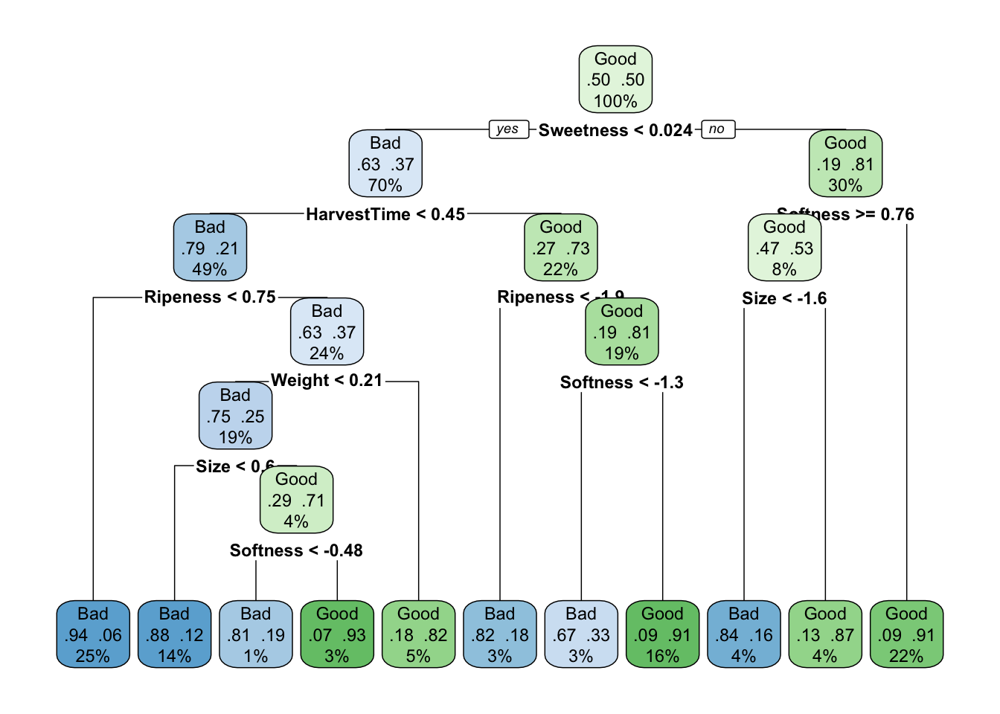

## Executive Summary

A model-driven approach to quality classification can significantly reduce operational cost in perishable supply chains. In this analysis, the K-Nearest Neighbors (KNN) model achieved approximately **98% accuracy**, reducing estimated losses from **$390K–$410K per day to ~$77K per day**, representing over **$120M in potential annual savings**.

Perishable supply chains rely on timely and accurate quality signals to guide sorting, inventory allocation, and distribution decisions. In practice, these signals are often delayed and dependent on manual inspection, leading to inefficiencies, higher labor costs, and avoidable waste.

This project evaluates whether machine learning can improve the speed and consistency of quality classification using bananas as a case study. Multiple models were developed and tested to assess how measurable product attributes can be used to predict quality in a high-volume environment.

Results show that improving classification accuracy directly enhances operational decision-making. Earlier identification of low-quality inventory enables more efficient sorting, better inventory prioritization, and reduced reliance on manual inspection.

These findings demonstrate that a model-driven approach can materially improve efficiency and reduce cost at scale. A pilot implementation in a high-volume distribution environment is recommended to validate performance and support broader deployment.

## Project Overview

This project evaluates the use of machine learning to improve quality classification in perishable goods supply chains, where inaccurate assessments can lead to significant waste, inefficient sorting, and suboptimal inventory decisions.

Using bananas as a case study, multiple classification models were developed and tested based on product attributes such as sweetness, acidity, ripeness, and weight. The goal was to identify an approach that can reliably distinguish between high- and low-quality items in a high-volume distribution environment.

The analysis evaluates how predictive modeling can improve classification accuracy and consistency at scale, and how these improvements can translate into more efficient sorting, better inventory allocation, and stronger downstream distribution decisions. Results demonstrate that model-based classification can meaningfully reduce misclassification and support more reliable operational decision-making.

Detailed methodology and model development are provided in the Appendix and supporting analysis files.

## Business Problem

Perishable supply chains rely on fast, accurate quality signals to guide sorting, inventory allocation, and distribution decisions. In practice, these signals are often delayed, inconsistent, and heavily dependent on manual inspection.

As a result, low-quality inventory is frequently identified too late, after it has already moved through storage and transportation, driving unnecessary handling and logistics costs. At the same time, limited visibility into product condition reduces the ability to prioritize inventory effectively, weakening sorting and allocation decisions.

This creates three core challenges: **operational inefficiency, elevated labor costs from manual inspection, and suboptimal inventory decisions.** Together, these issues lead to avoidable cost and reduced efficiency across perishable supply chains.

Addressing these challenges requires a more consistent and timely approach to identifying product quality, enabling earlier and more informed decision-making across operations.

## Analytical Approach

A predictive modeling approach was used to generate an earlier and more consistent signal of product quality to support operational decision-making. Bananas were used as a case study to evaluate whether measurable product attributes could reliably indicate overall quality.

The analysis followed three steps: data preparation, model development across multiple classification methods (LR, KNN, DT), and performance evaluation to identify the most effective approach.

The goal was to test whether a model-driven signal could improve the speed and consistency of quality assessment. Detailed methodology and technical outputs are provided in the Appendix.

## Model Evaluation

Multiple classification models were evaluated based on accuracy and their ability to minimize misclassification.

- **Logistic Regression:** ~87% accuracy; strong baseline, but higher misclassification limits its ability to support reliable operational decisions  
- **Decision Tree:** ~89% accuracy; improved performance with better pattern capture, though classification errors remain at a level that can impact decision quality  
- **KNN:** ~98% accuracy; substantially reduces misclassification, providing the most reliable signal for identifying low- and high-quality inventory  

### Model Selection
KNN was selected as the preferred model due to its superior accuracy and consistency in identifying both high- and low-quality items.

By reducing misclassification, the model improves the reliability of quality signals used in sorting and inventory decisions, lowering the likelihood of low-value products moving through the supply chain unnecessarily.

Detailed model outputs and confusion matrices are provided in the Appendix.

## Key Findings

- **Quality can be predicted with high reliability using measurable attributes.**  
  Model performance shows that product characteristics such as sweetness, ripeness, and acidity provide a strong signal for distinguishing between high- and low-quality items.

- **Reducing misclassification materially improves decision quality.**  
  The difference in model performance demonstrates that even small improvements in accuracy can significantly reduce the likelihood of low-quality inventory being misidentified, which directly impacts sorting and handling decisions.

- **Earlier identification of low-quality inventory is critical.**  
  The ability to flag lower-quality items sooner enables more proactive decision-making, allowing operations to prioritize, reroute, or remove inventory before additional costs are incurred.

- **Model-driven signals outperform manual or reactive approaches.**  
  A consistent, data-driven classification approach reduces reliance on manual inspection and provides a more scalable and repeatable way to assess product quality across high-volume environments.

## Business Impact
At scale, improved classification accuracy reduces the cost of misclassification, a key driver of waste and inefficiency in perishable supply chains.

When low-quality inventory is identified too late, it continues through storage and transportation, accumulating cost without delivering value. Misclassifying good inventory also leads to unnecessary product loss. Improving accuracy reduces both types of errors.

To estimate impact, a simplified cost model was used with representative assumptions based on industry-scale operations:
- ~10 million units processed per day (illustrative high-volume distribution scenario)  
- ~10% low-quality rate (reflecting typical spoilage and variability in perishable goods)  
- $0.50 cost per missed low-quality unit (handling, logistics, and spoilage)  
- $0.30 cost per incorrectly discarded high-quality unit (lost revenue)  

Under these assumptions, estimated losses decrease from approximately **$390K–$410K per day to ~$77K per day**, representing over **$120M in potential annual savings**.

These estimates are directional and intended to illustrate the magnitude of impact. Detailed assumptions and calculations are provided in the Appendix.

## Operational Recommendation

Based on the analysis, implementing a model-driven approach to quality classification can materially improve decision-making and reduce operational cost in perishable supply chains.

### Recommended Approach

- **Deploy the model at the point of intake or sorting**  
  Use the model early in the process to identify low-quality inventory before it enters storage and distribution.

- **Prioritize inventory based on predicted quality**  
  Route higher-risk items for faster processing, discounting, or removal to minimize downstream cost.

- **Reduce reliance on manual inspection**  
  Use the model to support or replace repetitive quality checks, improving consistency and lowering labor requirements.

### Implementation Strategy

- **Pilot in a high-volume distribution center**  
  Test performance in a real operational environment to validate accuracy and cost impact.

- **Monitor key metrics**  
  Track misclassification rates, waste levels, and handling costs to measure effectiveness.

- **Refine and scale**  
  Adjust the model based on real-world data, then expand deployment across additional facilities.

### Key Considerations

- **Scalability and performance**  
  Ensure the selected model can operate efficiently in high-volume environments.

- **Integration with existing systems**  
  Align with current inventory and logistics workflows for seamless adoption.

- **Data quality and consistency**  
  Maintain reliable input data to ensure ongoing model performance.

  ## Limitations & Next Steps

### Limitations

- **Dataset representativeness**  
  The modeling dataset is balanced for training purposes and does not reflect real-world quality distributions, which are typically skewed toward higher proportions of good inventory.

- **Simplified cost assumptions**  
  The cost model is based on illustrative assumptions around volume, quality mix, and unit costs. While useful for estimating magnitude, actual impact will vary by operation.

- **Static model environment**  
  The analysis assumes consistent product attributes and does not account for changes over time, such as seasonal variation, storage conditions, or supply chain disruptions.

- **Model deployment considerations**  
  The selected model (KNN) delivers strong performance but may require optimization for scalability and real-time use in high-volume environments.

### Next Steps

- **Validate with real operational data**  
  Test the model using live data from a distribution environment to confirm performance and refine assumptions.

- **Incorporate real-time inputs**  
  Integrate additional signals such as temperature, handling conditions, and time in transit to improve prediction accuracy.

- **Optimize for scalability**  
  Evaluate alternative models or optimizations that maintain performance while improving computational efficiency.

- **Expand to other perishable categories**  
  Extend the approach beyond bananas to assess applicability across broader product categories.

- **Refine cost model**  
  Replace simplified assumptions with company-specific data to generate more precise estimates of financial impact.

## Appendix

### A. Data Overview
### B. Data Preparation
### C. Model Development
### D. Model Evaluation Details
### E. Cost Model & Assumptions

---
## A. Data Overview 

### Dataset Description  
The dataset consists of banana samples used to classify product quality as either *Good* or *Bad*. Each observation represents a single banana sample described by physical and chemical attributes that influence perceived quality. These features are used to train classification models aimed at improving early-stage sorting decisions in the supply chain.

### Key Variables  
The target variable is **quality**, a binary classification indicating whether a banana is *Good* or *Bad*.  

Predictor variables include:  
- Size  
- Weight  
- Sweetness  
- Softness  
- HarvestTime  
- Ripeness  
- Acidity  

All predictor variables are continuous and represent measurable characteristics that influence product quality.

### Data Size & Structure  
The dataset contains **8,000 observations across 8 variables**, including 7 predictor features and 1 target variable.  

All predictor variables are numeric, while the target variable is categorical with two levels (*Good* and *Bad*). This structure supports binary classification modeling.

### Data Quality  
The dataset is structurally complete, with **no missing values across any variables**, eliminating the need for imputation or data recovery.  

The target variable is **well balanced**, with approximately equal representation of *Good* (4006) and *Bad* (3994) observations, reducing the risk of model bias toward a single class.  

All continuous variables were **standardized prior to modeling**, resulting in values approximately within the range of -8 to +8. This preprocessing step ensures that all features contribute proportionally and prevents variables with larger scales from disproportionately influencing the model.  

Summary statistics indicate that feature distributions are consistent and do not contain obvious anomalies or invalid values. While the dataset appears clean and well-prepared for modeling, further validation with real-world operational data would strengthen confidence in deployment.

### Visual Snapshot & Feature Insights  

#### Logistic Regression Feature Importance  

  

The logistic regression model provides insight into how each feature influences the likelihood of a banana being classified as *Good*.  

- **Weight and Sweetness** are the strongest positive predictors of quality  
- **Ripeness and Harvest Time** also significantly increase the likelihood of a banana being classified as high quality  
- **Size** has a positive but more moderate impact  
- **Acidity** has a negative relationship with quality, indicating higher acidity is associated with lower quality bananas  
- **Softness** has a smaller but still statistically significant effect  

These relationships align with real-world expectations of produce quality, reinforcing that the model is capturing meaningful patterns rather than noise.

### Why It Matters  
The variables captured in this dataset directly reflect the attributes used to evaluate banana quality in real-world supply chains. By leveraging these features, the model enables earlier and more accurate classification of product quality before distribution.  

This improves sorting decisions, reduces misclassification of low-quality produce, and ultimately lowers operational losses in high-volume distribution environments.

---
## B. Data Preparation

### Overview  
Before training the models, the dataset was prepared to ensure consistency, comparability across features, and suitability for classification tasks.

### Data Cleaning  
The dataset required minimal cleaning. All variables were complete, with no missing values detected, eliminating the need for imputation. Data types were verified to ensure compatibility with modeling techniques.

### Feature Scaling  
All continuous variables were standardized prior to modeling. This transformation centers each feature around zero and scales it based on its standard deviation.

Standardization was applied to:
- Ensure comparability across variables with different units and ranges  
- Prevent features with larger magnitudes from disproportionately influencing model performance  
- Improve the effectiveness of distance-based models such as K-Nearest Neighbors  

### Train-Test Split  
The dataset was divided into training and testing sets using an 80/20 split.

- **Training set (80%)**: Used to train the models  
- **Test set (20%)**: Used to evaluate model performance on unseen data  

This approach ensures that performance metrics reflect the model’s ability to generalize beyond the training data.

### Target Variable Encoding  
The target variable (**quality**) was encoded as a binary classification:

- Good → 1  
- Bad → 0  

This encoding enables compatibility with classification algorithms such as logistic regression.

These preprocessing steps ensure that the dataset is clean, well-structured, and appropriately scaled for modeling. This foundation allows the models to learn meaningful patterns without bias introduced by data inconsistencies or feature scale differences.

---
## C. Model Development

To predict banana quality, multiple classification models were developed and compared to identify the most accurate and reliable approach for minimizing misclassification in a supply chain context.

### Models Evaluated  

- **Logistic Regression** – Used as a baseline for interpretability and understanding feature relationships  
- **K-Nearest Neighbors (KNN)** – A distance-based model suited for capturing similarity between observations  
- **Decision Tree** – A rule-based model capable of capturing non-linear relationships  

### Training Approach  

The dataset was split into **80% training and 20% testing** to evaluate model performance on unseen data. Each model was trained on the training set and evaluated using consistent metrics.

A multi-model approach was used to ensure that model selection was based on comparative performance rather than a single method. Final model selection is discussed in the evaluation section.

---
## D. Model Evaluation Details

### Overview  
Model performance was evaluated using accuracy, sensitivity, specificity, and confusion matrices to understand both overall performance and the types of errors each model produces.

### Logistic Regression  

  

Logistic Regression achieved an accuracy of **87.24%**, with balanced sensitivity (**0.8747**) and specificity (**0.8702**), indicating consistent but moderate performance across both classes.  

From the confusion matrix, the model produces a noticeable number of both false positives and false negatives, showing limitations in accurately separating high-quality and low-quality bananas.  

This is expected, as Logistic Regression assumes a linear relationship between features and the outcome. While it provides strong interpretability and clear insight into feature relationships, it struggles to capture more complex, non-linear patterns present in this dataset.

### K-Nearest Neighbors (KNN)  

  

KNN achieved the highest performance with an accuracy of **97.94%**, along with very high sensitivity (**0.9850**) and specificity (**0.9738**).  

The confusion matrix shows that KNN makes very few classification errors, significantly reducing both false positives and false negatives. This indicates strong generalization to unseen data.  

KNN performs particularly well in this context because banana quality appears to be driven by **local similarity between observations**. Since all features were standardized, distance-based comparisons are meaningful, allowing KNN to effectively identify patterns that other models miss.

### Decision Tree  

  

  

The Decision Tree model achieved an accuracy of **88.56%**, with sensitivity (**0.8972**) and specificity (**0.8739**), slightly outperforming Logistic Regression but still below KNN.  

While the confusion matrix shows improved classification compared to Logistic Regression, it still produces more errors than KNN.  

The tree visualization highlights how the model makes decisions using feature thresholds (e.g., sweetness, ripeness, and harvest time), capturing non-linear relationships in the data. However, Decision Trees are sensitive to small variations and can overfit, which may explain the reduced performance on test data.  

Despite this, the model provides strong interpretability through clear decision rules.

### Model Comparison & Final Selection  

Across all models, **K-Nearest Neighbors (KNN)** clearly outperforms the alternatives:

| Model | Accuracy |
|------|--------|
| Logistic Regression | 87.24% |
| Decision Tree | 88.56% |
| KNN | 97.94% |

Most importantly, KNN minimizes:
- **False Positives** (low-quality bananas incorrectly classified as high quality)  
- **False Negatives** (high-quality bananas incorrectly discarded)  

Both types of errors have direct operational costs, making error reduction critical.  

Given its superior accuracy, strong balance across error types, and ability to capture similarity-based patterns, **KNN was selected as the final model**.

### Summary  

The evaluation shows that while Logistic Regression and Decision Trees provide useful baseline and interpretability benefits, KNN delivers significantly stronger predictive performance. Its ability to reduce misclassification makes it the most effective model for improving decision-making and reducing losses in banana quality assessment.

---
## E. Cost Model & Assumptions

To estimate the financial impact of using machine learning models for banana quality prediction, the following assumptions are used:

| **Assumption** | **Description** | **Value** |
|----------------|----------------|-----------|
| **Total bananas processed per day** | Estimated market volume based on consumption and market share | **10 million/day** |
| **Cost of misclassifying a bad banana as good** | Includes shipping, handling, spoilage, and customer dissatisfaction | **$0.50** |
| **Cost of misclassifying a good banana as bad** | Represents lost revenue from discarding sellable product | **$0.30** |
| **Quality distribution** | Assumed real-world distribution of banana quality | **10% bad / 90% good** |
| **Model performance metrics** | Derived from confusion matrices (accuracy, sensitivity, specificity) | *Model-specific* |

### Error-Based Cost Calculation  

Total cost is calculated based on model misclassification:

**Total Cost = (Bad classified as Good × $0.50) + (Good classified as Bad × $0.30)**  

Where:
- **Bad classified as Good** → poor-quality bananas entering distribution  
- **Good classified as Bad** → sellable bananas being discarded  

### Daily Volume Breakdown  

- Total bananas processed per day: **10,000,000**  
- Bad bananas (10%): **1,000,000**  
- Good bananas (90%): **9,000,000**  

These values are combined with model error rates to estimate total daily cost.

## F. Cost Impact of Each Model

### Logistic Regression

- Misses ~12.5% of bad bananas → **125,000** bad bananas classified as good  
- Incorrectly discards ~13.0% of good bananas → **1,170,000** good bananas classified as bad  

**Estimated daily cost:**
- 125,000 × $0.50 = **$62,500**  
- 1,170,000 × $0.30 = **$351,000**  

**Total = $413,500 per day**  
**Annual Cost ≈ $151M**

### K-Nearest Neighbors (KNN)

- Misses ~1.5% of bad bananas → **15,000** bad bananas classified as good  
- Incorrectly discards ~2.6% of good bananas → **234,000** good bananas classified as bad  

**Estimated daily cost:**
- 15,000 × $0.50 = **$7,500**  
- 234,000 × $0.30 = **$70,200**  

**Total = $77,700 per day**  
**Annual Cost ≈ $28M**

### Decision Tree

- Misses ~10.3% of bad bananas → **103,000** bad bananas classified as good  
- Incorrectly discards ~12.6% of good bananas → **1,134,000** good bananas classified as bad  

**Estimated daily cost:**
- 103,000 × $0.50 = **$51,500**  
- 1,134,000 × $0.30 = **$340,200**  

**Total = $391,700 per day**  
**Annual Cost ≈ $143M**

### Cost Comparison Summary

| Model | Daily Cost | Annual Cost |
|------|-----------:|------------:|
| Logistic Regression | $413,500 | ~$151M |
| Decision Tree | $391,700 | ~$143M |
| KNN | $77,700 | ~$28M |

### Estimated Savings from KNN

Compared to Logistic Regression:
- **Daily savings:** ~$335,800  
- **Annual savings:** ~$122M  

Compared to Decision Tree:
- **Daily savings:** ~$314,000  
- **Annual savings:** ~$115M  

### Business Interpretation

While all models improve classification accuracy, the financial impact varies significantly at scale. KNN reduces both:
- the number of low-quality bananas entering distribution, and  
- the number of good bananas unnecessarily discarded.  

This leads to a substantial reduction in operational losses, making KNN the most effective model not only from a predictive standpoint but also from a business value perspective.

### Time Horizon  

Costs are calculated on a **daily basis** and extrapolated to an **annual impact** to reflect real-world operational scale.
